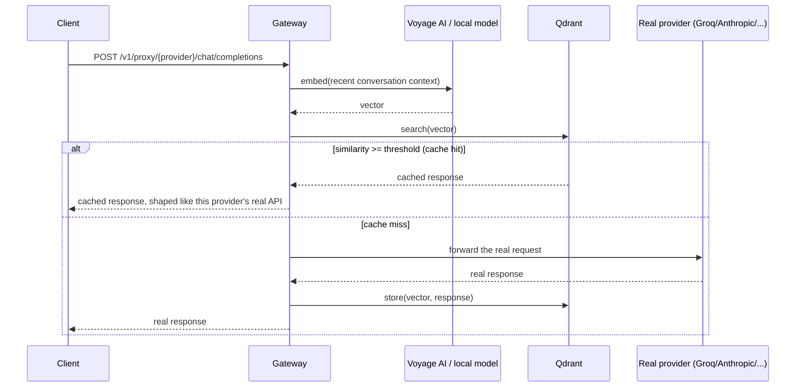
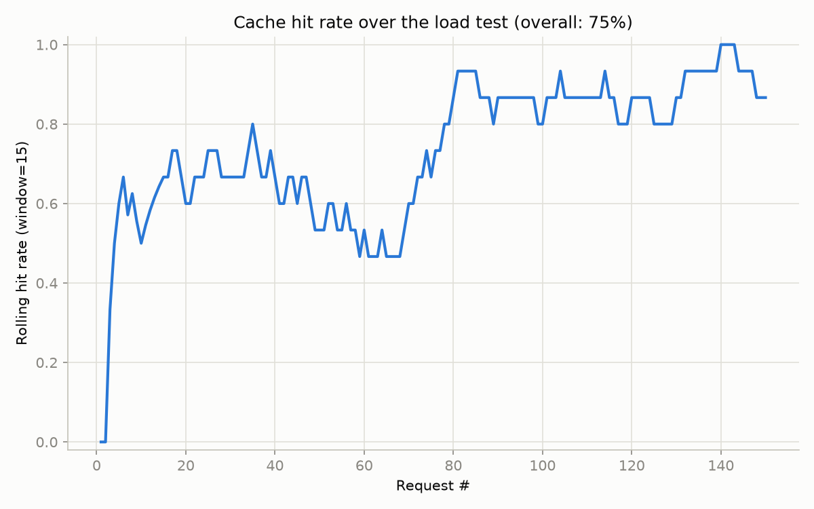
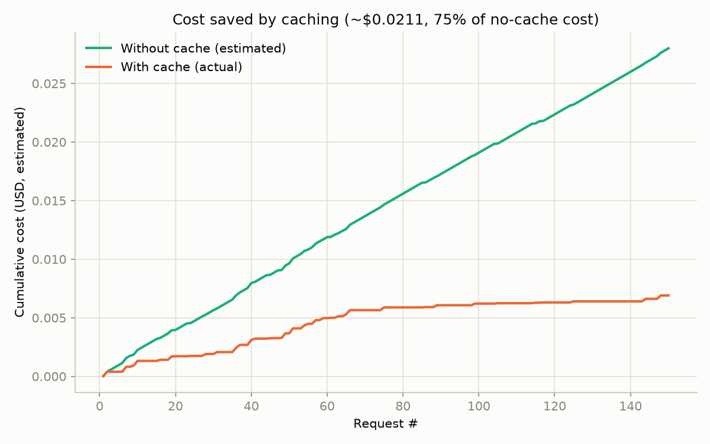
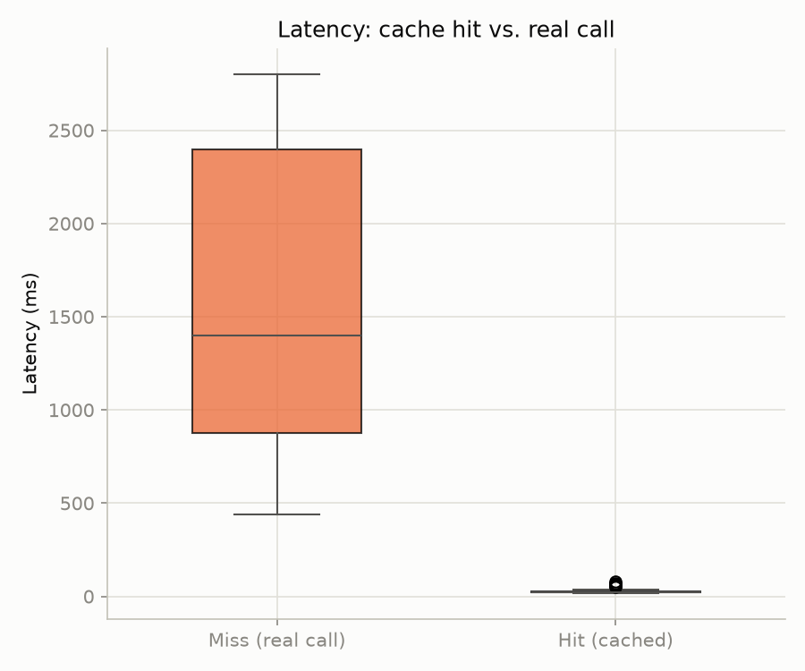
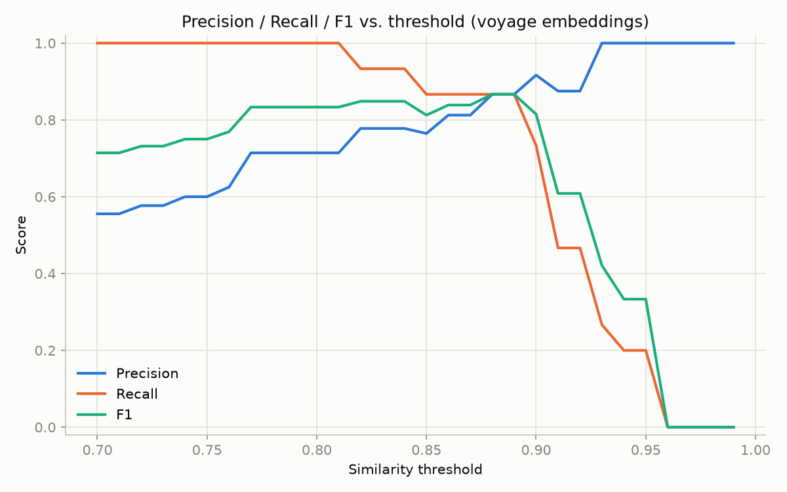

# llm-cache-gateway

## Problem

Every application built on LLM APIs pays for the same thing over and over: near-identical prompts trigger full, billable model calls every single time, even when the "new" question is really just a rewording of something asked minutes (or seconds) ago.

- **Cost**: LLM API calls are billed per token. A support bot, internal tool, or any high-traffic LLM feature ends up paying full price for answers it has effectively already generated.
- **Latency**: Every call waits on a real model response — typically hundreds of milliseconds to a few seconds — even for a question the system has already answered.
- **Reliability**: Every avoidable call also counts against provider rate limits, making outages/throttling more likely exactly when traffic spikes.

Traditional exact-match caching barely helps, because real users rarely type the identical string twice — "What's your refund policy?" and "How do I get a refund?" mean the same thing but look like two different cache keys to a normal cache.

**llm-cache-gateway** sits between an application and its LLM provider as a drop-in proxy. It checks incoming prompts for *semantic* similarity to previously-seen prompts — not exact text match — and serves a cached response when a close-enough match exists, instead of paying for and waiting on a new model call.

## How it works



The embedding uses the last few messages, not just the latest one, so a follow-up question ("what about trains?") doesn't collide across two unrelated conversations that happen to end the same way. The similarity threshold (currently `0.93`) isn't a guess — it's picked from a labeled eval set; see [Threshold tuning](#threshold-tuning) below.

If the embedding provider (Voyage) is down or unconfigured, the gateway falls back to a local `sentence-transformers` model — same interface, no API key required, see `EMBEDDING_BACKEND` below.

## Quick start

```bash
git clone https://github.com/TRSxReaperOG/llm-cache-gateway.git
cd llm-cache-gateway
cp .env.example .env
# edit .env: set VOYAGE_API_KEY, or set EMBEDDING_BACKEND=local to skip it entirely
docker compose up --build
```

This starts Qdrant and the gateway together — nothing else to install. Confirm it's up:

```bash
curl http://localhost:8000/health
```

## Usage

The gateway exposes an OpenAI-compatible-shaped endpoint per provider. Your own API key is read from the request's `Authorization` header and forwarded upstream — the gateway never stores it:

```bash
curl -X POST http://localhost:8000/v1/proxy/groq/chat/completions \
  -H "Authorization: Bearer $GROQ_API_KEY" \
  -H "Content-Type: application/json" \
  -d '{
        "model": "openai/gpt-oss-20b",
        "messages": [{"role": "user", "content": "What is the capital of France?"}]
      }'
```

Supported `{provider}` values: `openai`, `groq`, `mistral`, `together` (all OpenAI-shaped), plus `anthropic`, `gemini`, `cohere`. Streaming (`"stream": true`) is currently supported for the OpenAI-shaped providers only; other providers return `501` if streaming is requested.

### Admin endpoints

```bash
curl http://localhost:8000/admin/stats              # total entries, hit count, per-provider breakdown
curl http://localhost:8000/admin/entries?limit=20    # recent cache entries
curl -X DELETE http://localhost:8000/admin/cache     # clear everything
curl -X DELETE http://localhost:8000/admin/cache/{id} # clear one entry
```

These have no auth yet — don't expose them publicly as-is.

## Configuration

See `.env.example` for the full list with explanations. The short version: `EMBEDDING_BACKEND` (`voyage` or `local`), `VOYAGE_API_KEY` (if using voyage), `QDRANT_URL`, `TTL_SECONDS`, `MAX_CACHE_SIZE`, `CONTEXT_MESSAGES`. Provider API keys (Groq, Anthropic, etc.) are **not** gateway config — they're supplied per-request by whoever calls the gateway.

## Adding a new provider

Each provider is one class implementing the `Adapter` interface (`src/llm_cache_gateway/adapters/base.py`):

- `extract_prompt(request_body)` — pull the latest user message out of that provider's request shape.
- `extract_cache_key_text(request_body)` — fold the last few messages into the text that actually gets embedded.
- `build_response(prompt, response_text)` — shape a cache-hit reply to look like this provider's real API response.
- `forward_request(request_body, api_key)` — send the real request upstream, return the raw response.
- `extract_response_text(raw_response)` / `extract_token_usage(raw_response)` — pull the reply text and token count out of a real response, for caching and logging.

Optionally, for streaming support: `forward_request_stream`, `extract_stream_text`, `format_stream_chunk`, plus `supports_streaming = True` (see `adapters/openai_shape.py` for a working example).

Then register an instance in the `ADAPTERS` dict in `main.py` — that's it, no changes needed anywhere else; the cache flow, routing, admin endpoints, and logging are all provider-agnostic.

## Benchmarks

150-request load test against a mix of repeated, paraphrased, and novel prompts (`benchmark/load_test.py` / `benchmark/plot_results.py`):



Hit rate climbs as the traffic pool gets reused — 75% overall in this run.



~75% of estimated cost avoided over the run (illustrative pricing, see `src/llm_cache_gateway/pricing.py`).



Cache hits were ~60x faster than real calls in this run (median 23ms vs. 1400ms) — no network round-trip to the provider at all.

## Threshold tuning

The `0.93` similarity threshold wasn't guessed — it's the lowest threshold with zero false positives on a 30-pair labeled eval set (true paraphrases vs. confusable-intent pairs with genuinely different correct answers). Full methodology and reasoning in `eval/THRESHOLD_DECISION.md`.



The eval set was also run against the local embedding fallback and compared to Voyage — see `eval/EMBEDDING_TRADEOFFS.md`.
